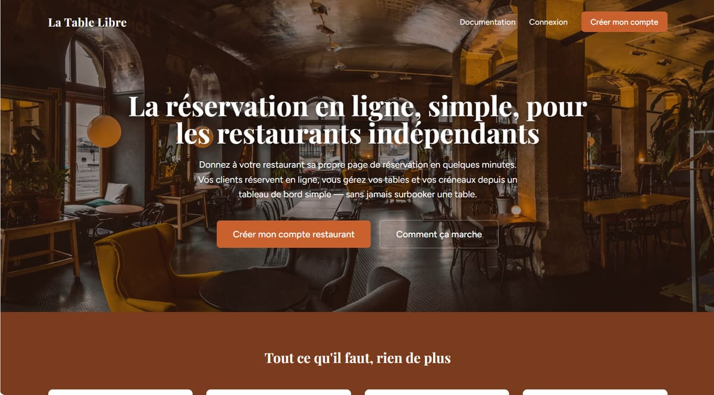

# Portfolio — Charbel Vodounnou

Site portfolio statique (une seule page HTML/CSS, sans dépendances).

## Structure

```
index.html
assets/
  cv/Charbel-Vodounnou-CV.pdf   → PDF servi par le bouton "Télécharger le CV"
  img/photo.png                 → photo de profil (hero)
  img/projects/                 → captures d'écran des projets (à ajouter)
```

## Ajouter les captures d'écran des projets

Chaque projet a actuellement un aperçu "wireframe" généré en CSS (dans `.browser-frame` / `.frame-body`, section Projets de `index.html`). Pour remplacer un wireframe par une vraie capture :

1. Dépose l'image dans `assets/img/projects/` (ex. `la-table-libre.jpg`).
2. Dans `index.html`, remplace le contenu du `.frame-body` correspondant par :
   ```html
   
   ```

## Mettre à jour le CV

Remplace `assets/cv/Charbel-Vodounnou-CV.pdf` par la nouvelle version, en gardant le même nom de fichier.

## Déploiement

Aucune étape de build. Héberge tel quel sur :
- **Vercel / Netlify** : glisser-déposer le dossier, ou connecter le repo GitHub (déploiement auto à chaque push)
- **GitHub Pages** : Settings → Pages → Source = branche `main`, dossier `/`
